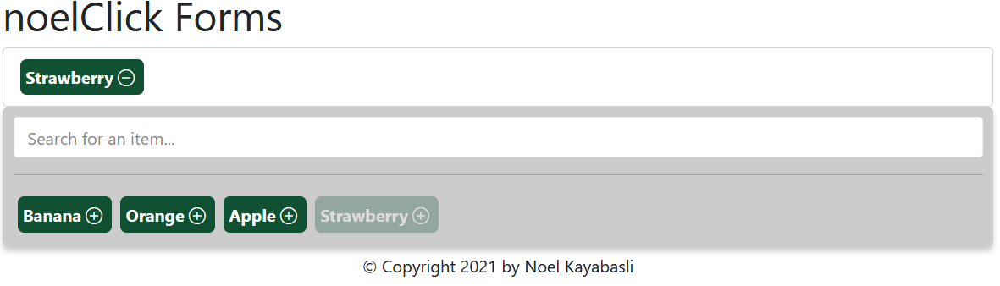

# noelClickForms
## Description
A useful JavaScript plugin to creat pretty forms.

All notable changes to this project will be documented in the **[Changelog](CHANGELOG.md)** file.

## Features
- Enhanced multi select field
    - With search option

## Contributors
- Noel Kayabasli <info@noel.click> ([@NoelClick](https://github.com/NoelClick))

## Usage
### Enhanced multi select field
```html
<select name="mySelect" id="mySelect" class="ncf-multiselect" multiple>
    <option value="1">Banana</option>
    <option value="2">Orange</option>
    <option value="3">Apple</option>
    <option value="3">Strawberry</option>
</select>
```
After including jquery and the `noelclickforms-0.0.1.min.js` you can create a default select field with a `multiple` attribute. Secondly add the class `ncf-multiselect` to the select field like shown above. Done!

<details>
<summary>Spoiler</summary>



</details>

## Dependencies
| Name            | Version | Description                                              |
|-----------------|---------|----------------------------------------------------------|
| jquery          | 3.5.1+  | Jquery is used for ajax calls and for the search script. |
| bootstrap icons | 1.7.2   | Bootstrap icons for the 'Add' and 'Remove' icons.        |


## Copyleft & LICENSE
© Copyright 2021 by Noel Kayabasli.

Licensed under the [MIT LICENSE](LICENSE).